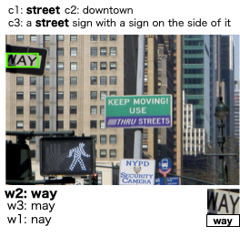
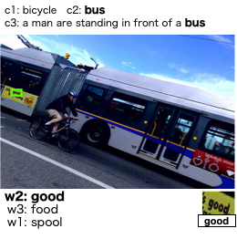
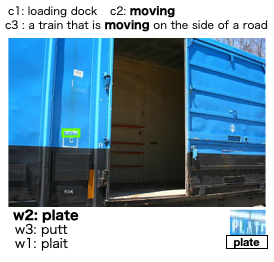
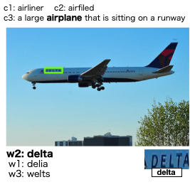
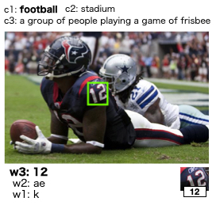

# Semantic Relatedness Based Re-ranker for Text Spotting

Implementation of the paper [Semantic Relatedness Based Re-ranker for Text Spotting](https://arxiv.org/pdf/1909.07950.pdf). sabir et al. EMNLP 2019.

The model here is a modified and improved version to handle two inputs (1) to learn a word-to-object relation directly with the overlapping layers and (2) it can be used for other sentence pair similarity tasks (e.g. sentence semantic similarity and duplicated answers), in addition to natural language inference.


## Introduction 
Applications  such  as  textual  entailment,  plagiarism detection or document clustering rely on the notion of semantic similarity,  and are usually approached with dimension reductiontechniques like LDA or with embedding-basedneural  approaches. We  present  a  scenario where semantic similarity is not enough, and we devise a neural approach to learn semantic relatedness. The scenario is text spotting in the wild, where a text in an image (e.g. streetsign,  advertisement  or  bus  destination)  must be  identified  and  recognized.   Our  goal  is  to improve the performance of vision systems by leveraging  semantic  information.   Our  rationale is that the text to be spotted is often related to the image context in which it appears (word pairs such as Delta–airplane, or quarters–parking are not similar, but are clearly related). We show how learning a word-to-word or word-to-sentence relatedness score can improve the performance of text spotting systems up to 2.9 points, outperforming other measures in a benchmark dataset.

## Requirements

- Python 2.7
- Tensorflow 1.15.0
- Keras 2.1.3
- Gensim 3.8.3
- NLTK 3.4.5

## Install 
```
conda create -n FDCLSTM python=2.7 anaconda
conda activate FDCLSTM
pip install -r requirements.txt
```
## Data
Pre-trained GloVe embeddings can be downloaded from here [glove.840B.300d.txt](http://nlp.stanford.edu/projects/glove/) 

More information about the training data can be found in this [paper](https://github.com/ahmedssabir/dataset)
 

## Training config 
First, we need to set the training config file:

```
{
  "train_data_file": "data/train.csv",
  "test_data_file": "data/test.csv",
  "embedding_file": "data/glove.840B.300d.txt",
  "embedding_file_type": "glove",
  "embedding_dim": 300,
  "embedding_trainable": true,
  "max_nb_words": 2000000,
  "max_seq_len": 30, 
  "re_weight": true,
  "model": "FDCLSTM",
  "nb_epoches": 5,
  "num_lstm": "random",
  "num_dense": "random",
  "rate_drop_lstm": "random",
  "rate_drop_dense": "0.6",
  "dense_activation": "relu"
}
```

Then run for training and prediction:
```
python FDCLSTM_visual_re-ranker.py config/FDCLSTM.json
```
## Quick Start 
Familiarize yourself with the model architecture  by running the model in Colab!

[Example of lighter model training and inference](https://github.com/ahmedssabir/Semantic-Relatedness-Based-Reranker-for-Text-Spotting/blob/main/FDCLSMT_Demo.ipynb)
## Demo 

/data/test.csv from COCO-text (ICDAR 2017)

Baseline [CNN90k Dic](https://www.robots.ox.ac.uk/~vgg/research/text/) 

<pre>
Test set input .. 
spotted word, caption (this example)  
</pre>

<pre>
 <b>bold</b> font is the overlap information (c2) ..,<b>object (c1)</b> ... <b>caption (c3)</b> 
</pre>



<pre>
<b>w2</b>, 0.2439044, way, a street sign with a sign on the side of it 
w3, 0.000359118, may, a street sign with a sign on the side of it  
w1, 4.2125583E-05 ,nay, a street sign with a sign on the side of it 
</pre>


<pre>
<b>w2</b>,0.53307146, good, a man and women are standing in front a bus 
w3, 0.39931786 ,food, a man and women are standing in front a bus 
w1, 0.0022411644, spool, a man and women are standing in front a bus 
</pre>



<pre>
<b>w2</b>, 0.0011877418, plate, a train this is moving on the side of a road   
w3, 0.000062719, putt, a train this is moving on the side of a road  
w1, 2.399087E-06 ,plait, a train this is moving on the side of a road   
</pre>


<pre>
<b>w2</b>, 0.44601023, delta, a larage airplane that is sitting on a runway 
w1, 0.0001919473, delia, a larage airplane that is sitting on a runway 
w3, 1.2445299E-05, welts, a larage airplane that is sitting on a runway 
</pre>


<pre>
<b>w3</b>, 0.4690555, 12, a group of people playing a game od frisebee 
w2, 0.008575866, ae, a group of people playing a game od frisebee
w1, 0.004281025, k, a group of people playing a game od frisebee
</pre>

Note that, for best result, the baseline softmax score is needed to be * with this score and then re-ranked again.

Download the [pretrained model](https://www.dropbox.com/s/kyhlkvtku5rs4y1/model_FDCLSTM_2021-05-22.h5?dl=0) 

More example here [examples](examples/README.md) 

## Adding your custom model

Please refer to [application ](https://github.com/ahmedssabir/Semantic-Relatedness-Based-Re-ranker-for-Text-Spotting-/tree/main/application) 

 
## Citation

Please use the following bibtex entry:
```bibtex
@inproceedings{sabir2019semantic,
  title={Semantic Relatedness Based Re-ranker for Text Spotting},
  author={Sabir, Ahmed and Moreno, Francesc and Padr{\'o}, Llu{\'\i}s},
  booktitle={Proceedings of the 2019 Conference on Empirical Methods in 
  Natural Language Processin Language Processing (EMNLP)},
  pages={3442--3448},
  year={2019}
}
```
